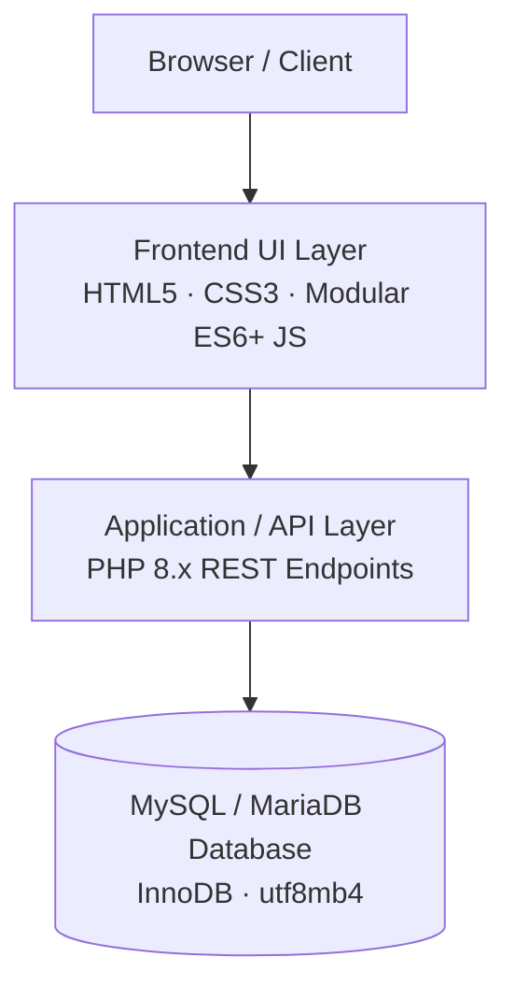
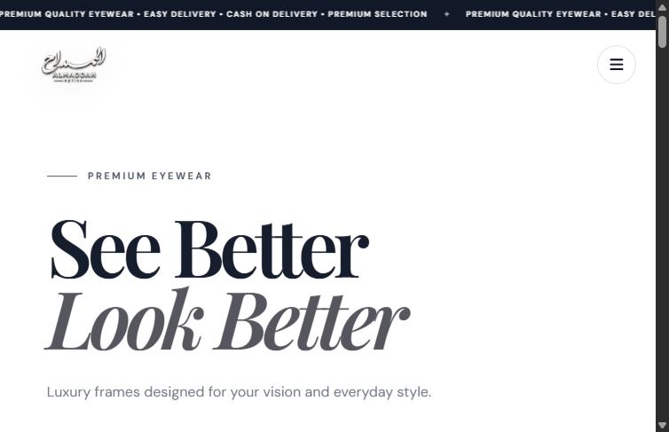
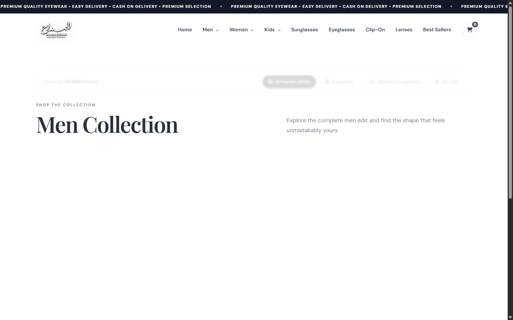
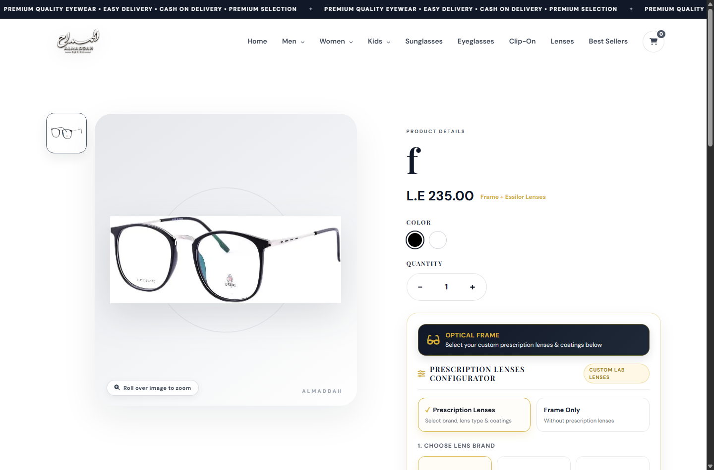
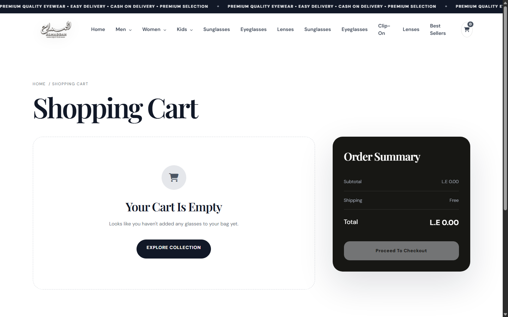
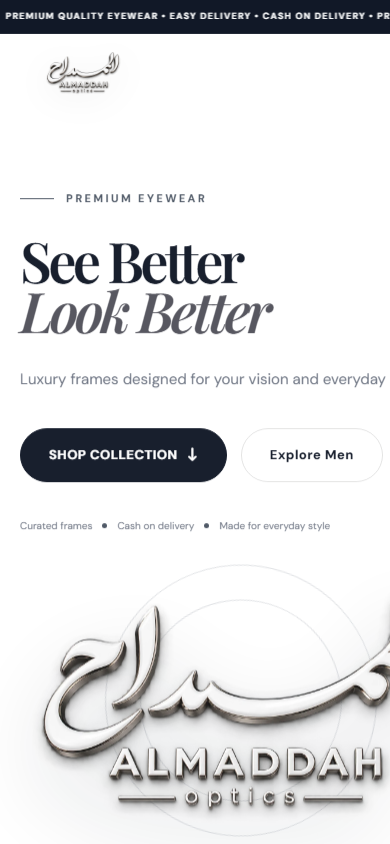

# ALMADDAH Optics

Eyewear E-Commerce & Prescription Lens Configurator

> **Public Engineering Case Study**  
> This repository is a public engineering case study for ALMADDAH Optics. The production source code is maintained in a private repository.

---

| Attribute | Details |
|---|---|
| **Project Type** | E-Commerce Web Application & Admin Console |
| **Domain** | Optical Retail & Custom Prescription Eyewear |
| **Architecture** | Decoupled Client-Server (REST API · Modular Frontend) |
| **Source Code** | Private Repository |
| **Deployment** | Hostinger |

---

## Overview

ALMADDAH Optics is an e-commerce platform developed for optical retail, supporting product browsing, collection filtering, and custom prescription lens ordering.

Unlike standard e-commerce stores that sell fixed SKUs, prescription eyewear requires pairing physical frames with certified ophthalmic lenses and specialized surface treatments. This application integrates an interactive prescription lens configurator directly into the purchasing flow, calculating combined prices in real time and capturing complete optical specifications for lab fulfillment.

The platform provides a public storefront for customers and an administrative control panel for inventory management, lens pricing matrices, and order tracking.

---

## Live Project

- **Live Demo / Temporary Deployment**: [peru-falcon-934987.hostingersite.com](https://peru-falcon-934987.hostingersite.com)

*Note: The link above points to the live deployment hosted on a temporary Hostinger domain for testing and demonstration purposes.*

---

## Key Features

- **Product catalog and collection browsing**: Browse collections across Men, Women, and Kids categories.
- **Category and subcategory filtering**: Filter products by frame utility: Sunglasses, Optical (Eyeglasses), and Clip-On frames.
- **Responsive storefront**: Layout designed for desktop, tablet, and mobile viewports.
- **Product detail pages**: View product specifications, high-resolution imagery, and color-variant switching.
- **Prescription lens configurator**: Configure lens brand, optical design, and multi-coating options with real-time price updates.
- **Cart management**: Itemized shopping cart with persistent local state across browser sessions.
- **Cash-on-delivery checkout**: Single-page checkout with form validation and promotional discount codes.
- **Administrative control panel**: Manage product inventory, upload images, update lens pricing rules, curate customer reviews, and inspect incoming orders.

---

## Prescription Lens Configurator

The prescription lens configurator is a core workflow component designed to handle the multi-step customization required for ophthalmic eyewear.

```
Select Frame ──▶ Lens Configurator ──▶ Choose Brand ──▶ Select Lens Type ──▶ Add Coatings ──▶ Add to Cart
```

### User & Technical Workflow

1. **Eligibility Check**: The application checks whether the selected frame has prescription lens customization enabled (`is_prescription = 1`, standard for Optical and Clip-On models).
2. **Brand Selection**: The customer selects from available optical lens manufacturers (such as *Essilor*, *ZEISS*, *Crizal*, or *HOYA*).
3. **Lens Type / Usage**: The customer chooses the required optical correction (Single Vision, Bifocal, or Progressive).
4. **Coating Selection**: Customers select optional surface treatments (Anti-Reflective, Blue Light Filter, Hydrophobic, Hard Scratch-Resistant Coat, UV400).
5. **Real-Time Pricing**: The combined total (`Frame Base Price + Lens Base Price + Selected Coatings`) is calculated on the client side as options are toggled.
6. **Cart Serialization**: On submission, the full lens configuration object is bundled directly with the frame item in browser storage (`localStorage`) and forwarded to the order API during checkout.

For complete technical specifications, see [docs/lens-configurator.md](docs/lens-configurator.md).

---

## Architecture

The system follows a decoupled client-server architecture with stateless REST endpoints and relational persistence.



The browser storefront communicates with the backend exclusively via HTTP requests receiving structured JSON responses (`backend/api.php` for the storefront and `backend/admin_api.php` for administration). Database communication uses PDO prepared statements to guard against SQL injection. Database initialization and schema checks verify required tables and columns during application bootstrapping.

For detailed layer descriptions and design decisions, see [docs/architecture.md](docs/architecture.md).

---

## Technology Stack

| Layer | Technology | Purpose |
|---|---|---|
| **Frontend** | HTML5, CSS3, JavaScript (ES6+) | Semantic markup, custom design token system, client-side filtering, and configurator state |
| **Backend** | PHP 8.x | REST API endpoints, parameter validation, order intake, and administrative operations |
| **Database** | MySQL / MariaDB | Relational persistence, `InnoDB` engine, foreign key constraints, `utf8mb4` encoding |
| **Typography & Icons** | Playfair Display, Inter, Font Awesome | Editorial serif typography, body text readability, and interface iconography |
| **Web Server** | Apache / LiteSpeed | HTTP routing, static file delivery, and PHP-FPM process execution |
| **Hosting** | Hostinger | Cloud web hosting and staging deployment |

---

## Screenshots

### Storefront Homepage
Hero presentation, category navigation, featured eyewear collections, and promotional banner.


### Eyewear Collection & Catalog
Multi-level category filtering across Men, Women, and Kids collections with subcategory filtering for Sunglasses, Optical, and Clip-On frames.


### Product Detail & Prescription Lens Configurator
Product detail interface showing frame specifications alongside the interactive lens brand, type, and coating configuration options.


### Shopping Cart & Order Breakdown
Persistent shopping bag showing itemized pricing for selected frames and attached prescription lens configurations.


### Mobile Storefront
Responsive viewport implementation preserving navigation, catalog filters, and checkout accessibility on mobile screens.
<p align="center">
  
</p>

---

## Engineering Highlights

- **Modular Native Frontend**: Built with native ES6+ JavaScript and CSS variables without heavy frontend framework dependencies, minimizing initial asset payloads and ensuring fast render times on mobile networks.
- **Dynamic Catalog Filtering**: Instant client-side filtering across gender categories and eyewear utility types without page reloads.
- **Decoupled Cart State**: Client-side cart state stored in `localStorage` retains configured items and lens metadata across page navigations without requiring upfront user authentication.
- **Unified Frame & Lens Data Structure**: Lens specifications are directly encapsulated within order items, ensuring optical laboratory requirements remain attached to the correct physical frame throughout fulfillment.
- **Database Schema Validation**: Automated schema inspection on startup checks table structures and ensures necessary columns are present across deployment environments.

---

## Repository Structure

```
almaddah-optics-showcase/
├── assets/
│   └── logo.png
├── docs/
│   ├── architecture.md
│   └── lens-configurator.md
├── screenshots/
│   ├── cart.png
│   ├── catalog.png
│   ├── home.png
│   ├── mobile.png
│   └── product_lenses.png
└── README.md
```

---

## Source Code

The production source code is maintained in a private repository because the application contains proprietary implementation details and production-specific configuration. This repository focuses on architecture, product functionality, and visual documentation.
