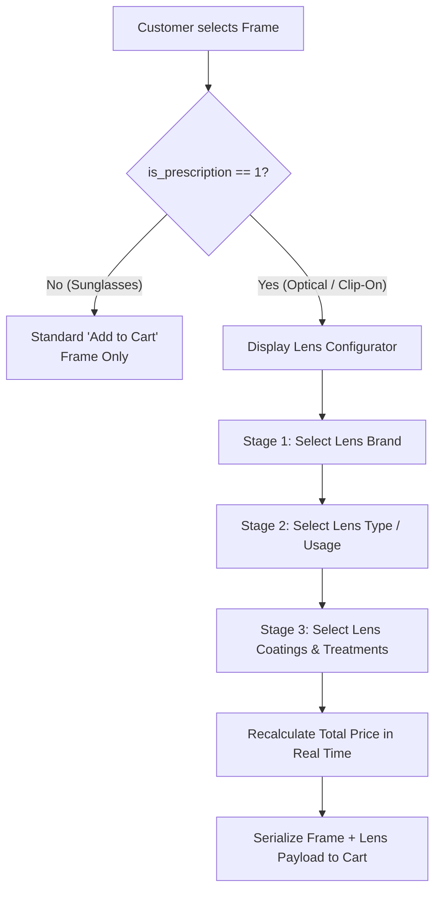

# Prescription Lens Configurator

This document outlines the workflow, technical architecture, and pricing mechanics of the **Prescription Lens Configurator** in ALMADDAH Optics.

---

## Overview

The lens configurator allows customers purchasing prescription-eligible frames (Optical frames and Clip-On frames) to select customized ophthalmic lenses, lens types, and surface treatments before adding the item to the cart. 

Instead of treating lenses as separate store items, the configurator bundles the selected lens configuration directly with the frame, calculating a unified price in real time.

---

## Configuration Workflow



---

## Configuration Stages

### 1. Frame Eligibility Detection
- Eyewear models in the database contain an `is_prescription` flag (integer boolean: `1` or `0`).
- Frames categorized under **Optical** or **Clip-On** automatically have prescription lens configuration enabled.
- For frames where `is_prescription = 0` (standard sunglasses), the lens configuration panel remains hidden, and the user proceeds with standard frame-only purchasing.

### 2. Lens Brand Selection
- The interface queries available lens brands from the database (e.g., *Essilor*, *ZEISS*, *Crizal*, *HOYA*, or house optical brands).
- Each brand provides specific lens material options, base price tiers, and available coatings.

### 3. Lens Type & Index Selection
- Customers select the optical design based on their visual requirements:
  - **Single Vision**: For distance correction or dedicated reading.
  - **Bifocal**: Segmented correction with defined reading areas.
  - **Progressive (Multifocal)**: Smooth gradient from distance through intermediate to near vision without visible dividing lines.
- Each lens type carries an associated base surcharge defined in the optical catalog.

### 4. Lens Coatings & Treatments
- Multi-select options allow customers to add specific protective and optical surface treatments:
  - **Anti-Reflective (AR) Coating**: Reduces glare from artificial lights, screens, and night driving.
  - **Blue Light Filter (Blue Cut)**: Filters high-energy blue-violet light emitted by digital displays.
  - **Hydrophobic / Oleophobic Coating**: Repels water droplets, dust, and fingerprint smudges for easier cleaning.
  - **Hard / Scratch-Resistant Coating**: Protective thermoset resin layer to minimize micro-scratches.
  - **UV400 Protection**: Blocks harmful UVA and UVB radiation.

---

## Pricing Calculation

Prices are calculated dynamically on the client side during selection and verified against the catalog during cart review:

$$\text{Item Total} = \text{Frame Base Price} + \text{Lens Base Price} + \sum (\text{Selected Coating Surcharges})$$

### Calculation Logic Example:
1. **Base Frame**: EGP 1,200
2. **Selected Lens Brand & Type** (e.g., ZEISS Single Vision): + EGP 600
3. **Selected Coatings** (e.g., Anti-Reflective + Blue Cut): + EGP 250
4. **Calculated Item Total**: **EGP 2,050**

As options are toggled in the UI, event listeners update the displayed total and the breakdown summary box without requiring a full page reload.

---

## State Persistence & Order Payload

When the customer clicks **Add to Cart**, the product object stored in `localStorage` includes both the base frame data and the configured lens object:

```json
{
  "productId": 14,
  "productName": "ALMADDAH Clubmaster Classic",
  "category": "optical",
  "framePrice": 1200.00,
  "quantity": 1,
  "color": "Black / Gold",
  "lensConfig": {
    "enabled": true,
    "brand": "ZEISS",
    "type": "Single Vision",
    "coatings": [
      "Anti-Reflective",
      "Blue Light Filter"
    ],
    "lensPrice": 850.00
  },
  "itemTotal": 2050.00
}
```

During checkout, this serialized JSON structure is sent to `backend/api.php` within the order request, where it is recorded in the `order_items` table. The administrative dashboard (`admin/`) unpacks this payload so opticians and lab technicians have exact specifications for lens cutting, edging, and mounting.
